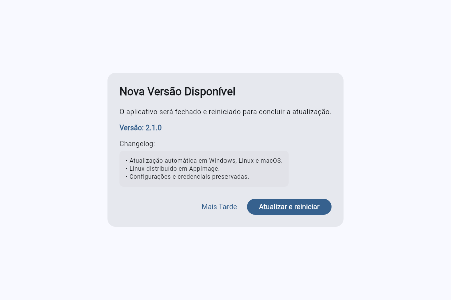

# Native desktop development

Arrmate includes Flutter runners for Windows, Linux, and macOS, generated
with Flutter 3.41.2, the version pinned in CI. These targets execute the
existing Dart application natively. They do not embed a browser or load the
web build. Tagged releases package the complete desktop bundles alongside
Android and iOS. Desktop releases include an in-app updater; Linux is distributed
as an AppImage. Installers and distribution signing remain separate work.

## Build and run

Build each target on its own operating system. Install Flutter 3.41.2 and run
these commands from the repository root:

```sh
flutter pub get
dart run flutter_launcher_icons
```

| Host | Run | Release build | Output |
| --- | --- | --- | --- |
| Windows | `flutter run -d windows` | `flutter build windows --release` | `build/windows/x64/runner/Release/` |
| Linux | `flutter run -d linux` | `flutter build linux --release` | `build/linux/x64/release/bundle/` |
| macOS | `flutter run -d macos` | `flutter build macos --release` | `build/macos/Build/Products/Release/Arrmate.app` |

Windows and Linux applications require the entire generated bundle, including
the `data` directory and libraries. Copying only the executable is insufficient.
On ARM hosts, use the output directory for the host architecture.

### Windows

Install Visual Studio 2022 with **Desktop development with C++**, the Windows
SDK, CMake tools, and the C++ ATL component required by
`flutter_secure_storage`. Visual Studio Code alone does not provide this
toolchain. Verify the setup with `flutter doctor -v`.

### Linux

On Ubuntu or Debian, install the native toolchain and secure-storage headers:

```sh
sudo apt-get update
sudo apt-get install clang lld llvm cmake ninja-build pkg-config libgtk-3-dev liblzma-dev libsecret-1-dev
```

The LLVM linker and archiver are needed for Flutter's native-assets build
configuration. The runtime requires GTK 3, `libsecret-1-0`, and an active desktop session
providing the Secret Service API, such as GNOME Keyring or a compatible
KWallet setup. This is needed to persist server credentials. The window icon
uses the existing `assets/images/icon.png` from Flutter's resolved bundle
asset directory.

### macOS

Install Xcode 26.1.1 or newer, its command-line tools, and CocoaPods. The
current `connectivity_plus` plugin requires this SDK to compile its guarded
satellite-network API. CI uses `macos-15` with the latest stable installed
Xcode. The application ID is `br.com.lucasliet.arrmate`, matching the mobile
targets. The runner includes:

- Network client entitlements in Debug/Profile and Release for service APIs,
  images, ntfy, and the online assistant.
- User-selected file read access for importing torrent files.
- Keychain access groups required by `flutter_secure_storage`.
- HTTP transport support for user-configured self-hosted servers, matching
  the existing iOS configuration, and a local-network usage description.
- Registration of the existing `arrmate://` URL scheme.

Select a development team in Xcode when building with a signing identity.
The release archive contains the application bundle. Signing, notarization,
and a disk-image installer are not configured.

## Runtime capabilities

Layout decisions and runtime capabilities remain separate. Native desktop
uses the existing IO services, file-system cache, preferences, secure storage,
file selection, and online assistant. CORS, mixed-content rules, and browser
file-input workarounds apply only to the web runtime.

The online assistant remains available on desktop, including models filtered
only for browser CORS. Provider authentication, availability, and free-tier
policies still apply; removing browser restrictions does not fix provider
rejections described in [Web deployment](web-deployment.md).

On-device inference depends on the platform. Android runs LiteRT-LM models
through the vendored plugin, which implements only Android. iOS, iPadOS and
macOS use the Apple Intelligence system model through the local
`packages/apple_foundation_models` plugin, which needs iOS 26 / macOS 26 at
runtime and an Xcode 26 or later SDK at build time; older systems and SDKs
report the model as unavailable. Windows, Linux and web keep only the online
assistant. Android updates install APKs;
desktop updates use their platform-specific release packages. In-app notifications and ntfy operate while the process
is running; closed-app background delivery is not added by generating runners.

The macOS URL scheme is registered. Windows protocol registration and Linux
desktop-file/URI activation still require platform packaging integration.

## Verification

`build.yml` builds Android, iOS, Windows, Linux, and macOS in parallel on their
respective GitHub Actions hosts when dispatched by the release workflow or manually
with an existing version tag. It has no push or pull-request trigger. Each target
uploads its package; Android uses the release keystore. Pull requests and pushes
to `main` run analysis, the test suite, and native updater replacement/recovery
tests on Windows and macOS without compiling application packages.

## Release packaging

`release.yml` publishes versions when a `v*` tag is pushed. After resolving the
tag to an immutable source revision, it dispatches `build.yml` on `main` and
waits for that run while release notes are generated independently. Running
the build from `main` lets every release share the Android Gradle build cache.
The release passes its own run number as the build number, so Android
`versionCode`, the iOS bundle version, and the AltStore source stay in step
and keep rising. That build workflow runs Android, iOS, and its desktop matrix
in parallel. A single publication job waits for the build run, downloads its
artifacts, creates the AltStore source, and publishes the complete release
together.

| Platform | Release asset |
| --- | --- |
| Android | `app-arm64-v8a-release.apk`, `app-armeabi-v7a-release.apk` |
| iOS | `arrmate.ipa`, `altstore.json` |
| Windows x64 | `arrmate-windows-x64.zip` |
| Linux x64 | `arrmate-linux-x64.AppImage` |
| macOS | `arrmate-macos.zip` |

Desktop packages include Flutter assets and libraries. Extract the complete
Windows/macOS archive before launching the executable or app bundle. On Linux,
make the AppImage executable and launch it directly. `tool/build_appimage.sh`
uses checksum-pinned linuxdeploy and appimagetool versions to bundle GTK,
libsecret, and their non-system dependencies. The host still needs a graphical
session, compatible system libraries, and a Secret Service provider. The
AppImage runtime normally uses FUSE; `--appimage-extract-and-run` works without it.
Tagged Linux builds update the bundled `version.json` before packaging because
Flutter 3.41.2 leaves it at the `pubspec.yaml` version despite build overrides.
Windows uses the executable's native `ProductVersion` resource; both packaging
and update preparation verify it against the release tag. Windows does not
generate a Linux-style `version.json`.

To rebuild an existing version after changing the release workflow, run the
**Release** workflow manually from `main` and supply its existing tag in the
`tag` input. The workflow builds that tag's source and updates its release;
it does not release the current `main` application code.

## Desktop updates



Release builds check GitHub at startup, at most once a day. The Version tile in
Settings forces a check. Windows selects `arrmate-windows-x64.zip`, Linux selects
`arrmate-linux-x64.AppImage`, and macOS selects `arrmate-macos.zip`; none falls back
to an Android APK. **Update and restart** downloads the package, verifies its
published size and SHA-256, and stages it beside the installed application.

A detached helper waits for Arrmate to exit before replacing the complete app.
Windows retries while DLL handles are released; macOS preserves framework
symlinks through `ditto`; Linux replaces the AppImage named by `APPIMAGE`, never
the runner inside a temporary mount. Linux restarts in extract-and-run mode so
updates also work on hosts without FUSE. A failed replacement restores and restarts
the previous version. Windows/Linux also recover if the replacement exits during
the initial launch check. macOS verifies that Launch Services accepts the launch;
later application crashes are not automatically rolled back.

The GitHub macOS distribution runs without App Sandbox so the application can
stage its replacement and start the detached installer. Before starting Flutter,
it imports missing Flutter preferences from the previous sandbox container once,
preserving server configurations and existing settings. The original preferences
remain intact; a failed import stops startup instead of silently resetting them.
Disposable caches are rebuilt outside the old container. This configuration is
for direct distribution and does not support Mac App Store submission.

The installation directory must be writable by the current user. The updater
does not elevate privileges or replace the user-data directories holding settings,
credentials, and caches. Move a read-only or translocated app to a writable
location before updating. Failed installations retain `install.log` in their
`.arrmate-update-*` staging directory for diagnosis. ZIP paths, extraction sizes,
and symlinks are validated before extraction. Existing desktop releases predating
this updater need one manual upgrade; bare Linux build bundles must migrate to
the AppImage before they can update automatically.

Before declaring a desktop target ready for distribution, check startup,
persisted credentials after a restart, an HTTP LAN server connection,
image caching, torrent-file selection, notification streaming, sharing,
and an assistant request on that operating system.

The shared responsive presentation is documented in
[Desktop and tablet layout](desktop-tablet-layout.md).
