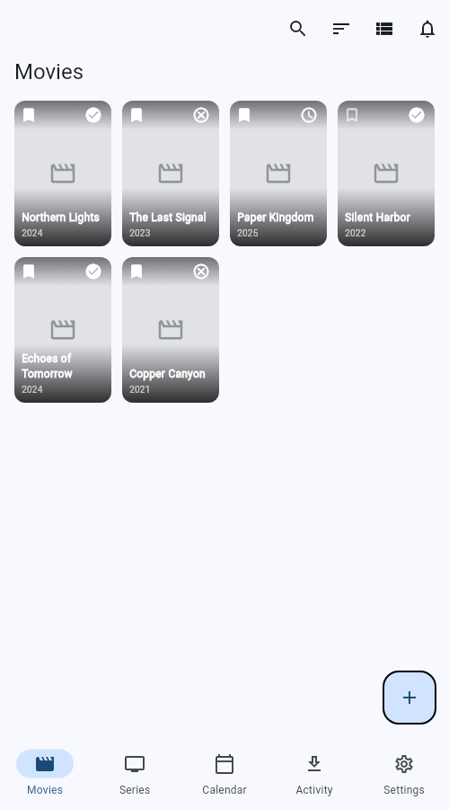
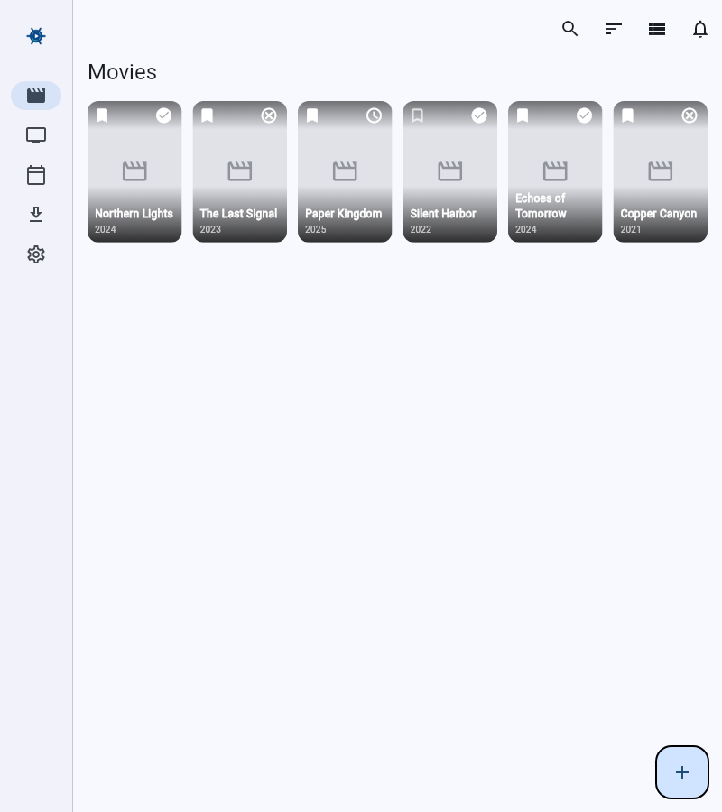
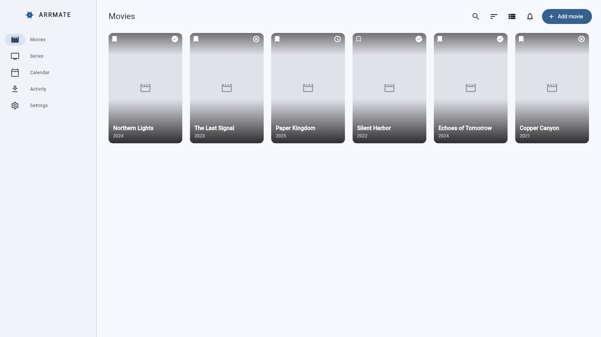
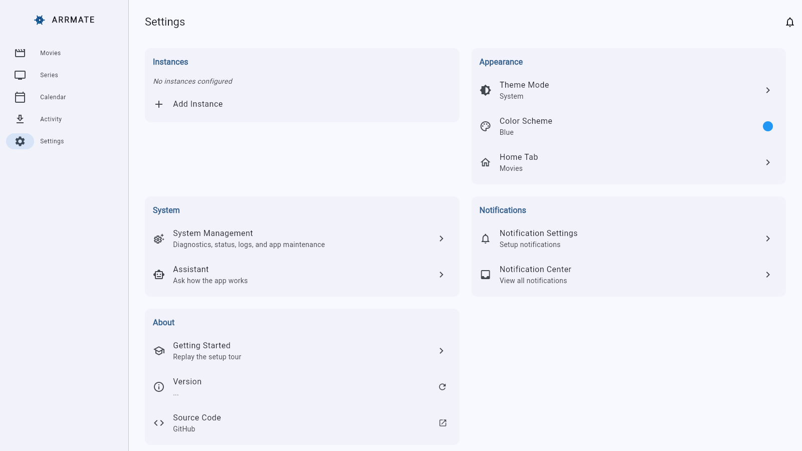

# Shared desktop, tablet, and web layout

Arrmate reuses its web presentation on native Windows, Linux, macOS,
Android tablets, and iPad. Layout follows available logical width. Native
services and browser restrictions continue to follow actual runtime
capabilities independently of layout.

## Navigation and content widths

`WindowClass` selects navigation from the shell's parent constraints.
`ContentLayout` and `AdaptiveLayout` measure the space left for each page
**after** navigation and the shell's maximum content width. A wide outer
window can therefore contain a compact page.

| Available shell width | Navigation |
| --- | --- |
| Below 600 | Bottom navigation |
| 600–899 | Icon navigation rail |
| 900–1439 | Extended navigation rail |
| 1440 and above | Extended navigation rail with bounded content |

| Available content width | Presentation |
| --- | --- |
| Below 900 | Compact calendar, activity, settings, and assistant headers |
| 900 and above | Existing wide headers, grouped settings, and calendar date panels |
| 1024 and above | Two settings columns, accounting for padding and panel spacing |
| 1200 and above | Library toolbar with Add movie/Add series, larger poster grids and detail heroes |

Content is bounded to 1600 pixels in the shell, 1100 in activity, and 900
in the assistant. Chat messages are capped at 640 pixels and use the local
conversation width on compact windows. Standard dialogs are capped at 560
pixels and modal sheets at 720, retaining the available width on smaller
windows. Poster typography follows each card's own width. Metadata grids
in both detail screens use their padded local constraints.

## Implemented presentation

The shared shell retains routes, offline status, notification entry points,
and tour anchors while switching between bottom navigation and the rail.
The rail scrolls when vertical space is limited. The content subtree remains
at the same position when the window is resized.

Movies and series share the same width policy for toolbars, grids, selection,
and detail screens. Search controllers, selected IDs, and scroll positions
survive resizing. Calendar date panels, settings sections, and activity tabs
reuse the existing wide design and retain compact layouts. Activity keeps
the selected tab when crossing a content breakpoint. Settings retains the
same scrollable while switching panel arrangements.

The assistant keeps a bounded conversation and its draft across window size
changes. Keyboard submission observes the same model-ready and generation
guards as the send button. Existing touch, long-press, mouse, scrolling, focus,
and dismissal behavior remain available. The guided tour positions the
navigation explanation beside a rail or above bottom navigation. In-app
assistant knowledge documents the sidebar and toolbar add buttons.

Colors, spacing, poster proportions, and card patterns continue to follow
`DESIGN_GUIDELINE.md`.

## Runtime capabilities

The migration does not set `isWeb` or substitute browser services to obtain
wide layouts. Runtime capabilities remain independent:

| Feature | Native desktop/tablet policy |
| --- | --- |
| HTTP APIs and online assistant | Native requests without browser CORS or mixed-content gating; provider policies and OS permissions still apply |
| Images, logs, preferences, and credentials | Existing native persistence, cache, and secure-storage implementations |
| Torrent-file selection | Native file picker and file access |
| Assistant model catalog | Native online availability, including models filtered only in browsers |
| Local assistant inference | Android only; the vendored LiteRT plugin has no desktop or iPad backend |
| App installation updates | Existing Android APK updater only |
| Notifications | Existing in-app/ntfy behavior; desktop closed-app background integration is separate |

Desktop runners, required OS permissions, dependencies, and CI builds are
covered in [Native desktop development](desktop-development.md). Provider-side
assistant restrictions are described in [Web deployment](web-deployment.md).

## Regression coverage and remaining device validation

Widget tests cover:

- Navigation boundaries 599/600, 899/900, and 1439/1440 with Windows, Linux,
  macOS, Android, and iOS theme settings; selected route, draft, scroll state,
  and available content width after the rail are preserved.
- Both libraries at the 1199/1200 content boundary inside a wider window,
  including long-press selection, search state, and scroll preservation.
- Calendar panels, settings columns and their scrollable, and activity tab
  preservation with a bounded body.
- Wide native assistant capability policies, draft preservation and keyboard
  submission, generation guards, readable model sheets, mouse-wheel scrolling,
  Escape dismissal, and compact touch scrolling.
- Existing movie/series details, guided tour, and platform capability tests.

Run the relevant widget tests in the Flutter VM and Chrome, the full test
suite, Dart analysis, and release web/Linux builds. Windows and macOS release
builds run on their corresponding hosts in `build.yml`.

Implementation validation with Flutter 3.41.2 passed Dart formatting and
analysis, 899 VM tests (three existing skips), the selected Chrome regression
suites, and release builds for web and Linux. The Linux bundle's dynamic
library dependencies resolved in the build environment. Widget-rendered
previews were inspected at 500, 800, and 1600 logical pixels, including
wide settings panels; these used sample library data. Windows/macOS builds
and physical-device runtime checks were not executed in this Linux workspace.

| Compact library (500 px) | Tablet library (800 px) |
| --- | --- |
|  |  |

Physical-device checks remain necessary before distribution: Android tablet
multi-window, iPad portrait/landscape and Split View, Windows/macOS startup,
secure credentials after restart, actual server and assistant requests,
file selection, trackpad gestures, and OS notification behavior. Screenshots
of representative compact, tablet, and desktop layouts should accompany UI
reviews. Desktop packages include an in-app updater and Linux AppImage; installers,
distribution signing, and notarization remain separate work.
